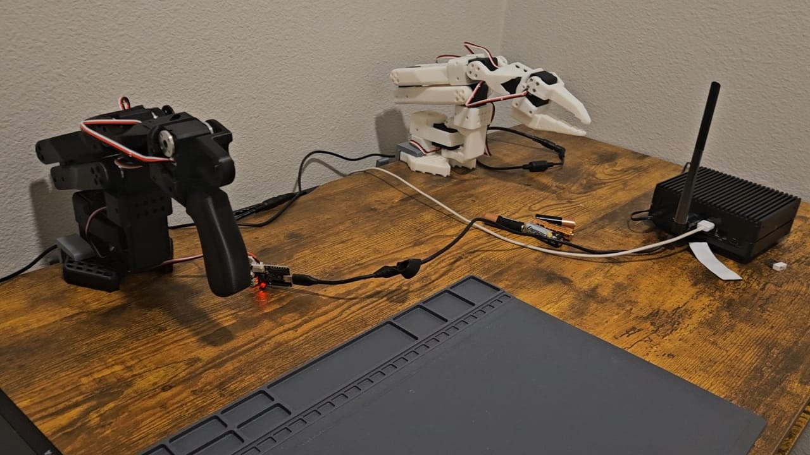

### The Setup


The current LeRobot Setup


Current System - ```Jetson Nano```

The LeRobot documentation link: [https://huggingface.co/docs/lerobot/en/so101](https://huggingface.co/docs/lerobot/en/so101)

### Logging into Jetson
1. Connect to the network.
2. Download and install NoMachine
3. Open NoMachine and in the devices section, there should be Jetson Nano
4. Click on Jetson, Login and Enter Password
5. Give it some time and you should see Jetson Login screen
6. ```Debug:``` If nothing is visible, close the NoMachine window and reopen and relogin to jetson
